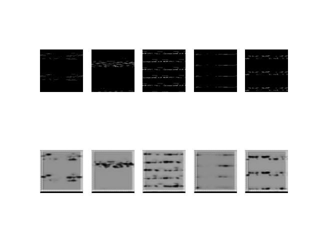
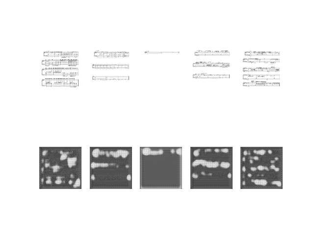
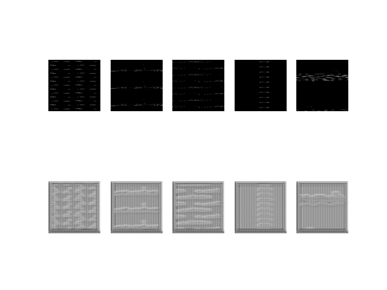
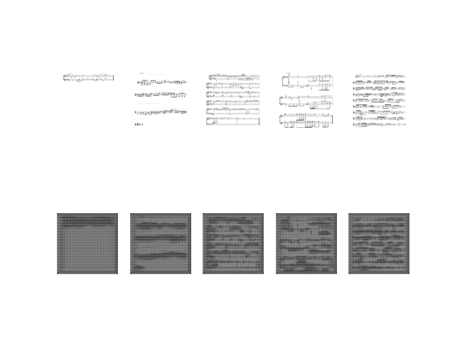

# 1. 프로젝트 목적

- 마음에 드는 음악을 피아노로 연주 해보고 싶을 때, 악보를 찾기 어려운 경우가 있다.
- 악보를 쉽게 구할 수 있도록 하기 위해 피아노 연주 곡을 악보로 생성해주는 서비스를 개발 

# 2. Role & Responsibility

- 참여 인원: 3인
  
  - 문 정 환: MuseScore3를 이용한 MIDI to Sheet 개발 / MIDI, 악보 데이터 가공
  - 윤 희 승: CycleGAN 설계 및 학습 / Flask 웹 어플리케이션 제작
  - 최 명 수: Onset frame Model을 이용한 Wav to MIDI 개발 / MIDI, 악보 데이터 가공

# 3. 개발 환경 및 기술 스택

- 기술 스택
  - Python
  - Tensorflow
  - Flask, HTML5, Javascript


- 실행 환경
  - PyCharm IDE
  - Anaconda virtual environment (Python 3.7)

# 4. Magenta 팀 Onset-frames 모델 설치, 실행 방법

## 4.1. 개발 환경 설정

``` pip install magenta ```

``` pip install rtmidi ``` 

``` git clone https://github.com/tensorflow/magenta.git ```

## 4.2. checkpoint 설치
- [piano model checkpoint](https://storage.googleapis.com/magentadata/models/onsets_frames_transcription/maestro_checkpoint.zip) which is trained on the MAESTRO dataset
- [drum model checkpoint](https://storage.googleapis.com/magentadata/models/onsets_frames_transcription/e-gmd_checkpoint.zip) which is trained on the E-GMD dataset

## 4.3. Magenta Onsets_frames 모델 테스트

- 피아노, 드럼의 wav 파일을 midi 파일로 변환하는 모델


- [0_1_args.py](0_1_args.py)
  - midi file로 변환할 .wav 파일이 저장되어 있는 경로를 텍스트 파일로 저장 


- [0_model_test.py](0_model_test.py)
  - FLAGS config 값을 'onesets_frames' 또는 'drums'로 변경
  - .wav 파일의 경로가 저장되어 있는 텍스트 파일의 경로 지정
  ```python
    #'onsets_frames' : piano, 'drums' : drum
    FLAGS.config = 'onsets_frames' 
    
    # piano_Train, piano_Test, drum_Train, drum_Test
    argv_path = './piano_Train.txt' 
    ```
---
# 5.  MIDI를 악보화하는 방법

- [midi_to_sheet.py](./midi_to_sheet.py)
  - MuseScore 3 는 CLI로 실행 가능
  - subprocess 모듈을 사용하여 외부 프로그램 MuseScore 3 실행
```python
    # 미디 폴더를 지정
    midi_folder = "./Moon_test_folder/midi/"
    # 출력 폴더를 지정
    sheet_folder = "./Moon_test_folder/sheets"
    # MuseScore3.exe의 경로를 지정
    MuseScore3_exe_path = "C:/Program Files/MuseScore 3/bin/MuseScore3.exe"
```
- 파라미터를 수정하고 py를 실행하면 지정된 폴더의 midi 파일들이 MuseScore3에 의해 악보화

---

# 6. Web APPLICATION

Flask 웹 프레임워크를 사용하여 Web 어플리케이션 제작

- [app.py](./app.py): 어플리케이션 실행 파일
    - 로컬 호스트에서 실행(127.0.0.1:5000)
      ```python
      # 악보 이미지를 보여주는 웹페이지 랜더링
      @app.route('/view',methods=['GET','POST'])
      def view():
      
      # 업로드한 wav 파일을 악보 이미지로 생성해주는 프로세스
      @app.route('/loading/<filename>')
      def loading(filename):
      
        #onset_frames(piano) 모델을 사용하여 midi 파일 생성
        wav_to_midi(filename)
        
        #midi 파일의 악보를 이미지로 생성
        midi_to_sheet(midi, sheet, musescore_exe_path)
       
      # 인덱스에 맞는 악보 페이지를 웹페이지에 다시 출력하도록 함 
      @app.route('/view/<string:name>/<int:idx>')
      def view_sheet(name, idx):
      
      # 악보 이미지를 zip 파일로 다운로드할 수 있도록 함
      @app.route('/download/<string:filename>')
      def download(filename):
      ```
    - ※ [midi to sheet](./midi_to_sheet.py): ([MuseScore3](https://musescore.informer.com/download/?ca1afaf5) 설치 필요)


- [index.html](./templates/index.html): 어플리케이션 첫 페이지
    - 파일 업로드: .wav 파일 업로드


- [upload.html](./templates/upload.html): 파일 업로드 페이지
  - .wav 파일을 선택하고 변환 버튼을 누르면 악보 이미지 생성 
  - 악보 로딩 화면 추가


- [fail.html](./templates/fail.html): 파일 업로드 실패 시 실행 페이지


- [view.html](./templates/view.html): 파일 업로드 성공 시
  - 생성한 악보 이미지 출력
  - wav 파일 재생 가능
  - 악보 이미지 파일(png) 다운로드 가능
  - 악보가 여러 장일 때 이전 버튼과 다음 버튼을 클릭했을 때 이벤트 발생
    ```html
      <script type="text/javascript">
      document.getElementById("prev").addEventListener("click",prev);
      document.getElementById("next").addEventListener("click",next);
    
      <!-- 이전 버튼을 클릭했을 때 호출되는 함수 -->
      function prev(){
        이전 악보 이미지를 출력
      }
    
      <!-- 다음 버튼을 클릭했을 때 호출되는 함수 -->
      function next(){
        다음 악보 이미지를 출력
      }
      </script>
      ```
---
# 7. ~~CycleGAN~~

- CycleGAN 모델을 이용하여 MIDI 파일을 악보 이미지(png) 파일로 생성할 수 있도록 하려고 하였으나 학습이 제대로 이루어지지 않음

## 7.1. Numpy Array Format으로 저장

- [1_sheet_2_numpy.py](1_sheet_2_numpy.py)
  - 악보 이미지를 grayscale 한 후 256x256 크기로 resize
  - numpy 배열로 변환하여 .npy 파일로 저장


- [1_1_midi_2_numpy.py](1_1_midi_2_numpy.py)
  - midi 파일을 numpy 배열로 변환
  - 악보 이미지와 동일하게 256x256 크기로 resize하여 .npy 파일로 저장


## 7.2. CycleGAN 모델 설계 및 학습
- [2_model_train.py](./2_model_train.py)
  - generator_AtoB -> midi 파일을 악보 파일로 생성하는 것을 학습
  - generator_BtoA -> 악보 파일을 midi 파일로 생성하는 것을 학습

## 7.3. Result

- 65 Epochs
  
  
    

- 650 Epochs

  


- 실패 원인 분석
  1. MIDI와 악보 데이터 양의 부족
  2. MIDI 도메인과 악보 도메인의 연관성
  3. MIDI 데이터의 주음계는 0~127 범위로 128개의 데이터로 표현되는데 numpy의 resize 함수로 MIDI 데이터의 크기를 강제적으로 늘렸더니 반복되는 부분이 생겨 문제가 발생한 것으로 예상

---
# 8. 향후 개발 방향

- 피아노 연주곡 뿐만 아니라 다른 악기, 대중 가요 등의 음악을 MIDI화 하는 연구가 지속되고 개발되면 서비스 확장 가능


- 외부 프로그램(MuseScore)에 의존하지 않고 MIDI 파일을 악보 이미지로 생성하는 프로세스 연구 및 개발 필요
  - MIDI 데이터는 연속적이기 때문에 자연어 처리 모델의 메커니즘을 활용하면 개선될 것으로 예상
  - 악보 형식이 고정되어 있기 때문에 악보 형식에 맞게 처리할 수 있는 AI 알고리즘 필요


- 작곡가의 저작권 문제 발생 가능 -> 저작권에 따른 무료 혹은 유료로 악보를 다운 받게 하도록 기능 개선

---
정리: [피아노 악보 생성 서비스](./take_notes.pdf)

Contact: <iyhs1858@gmail.com>
